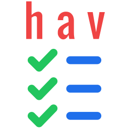
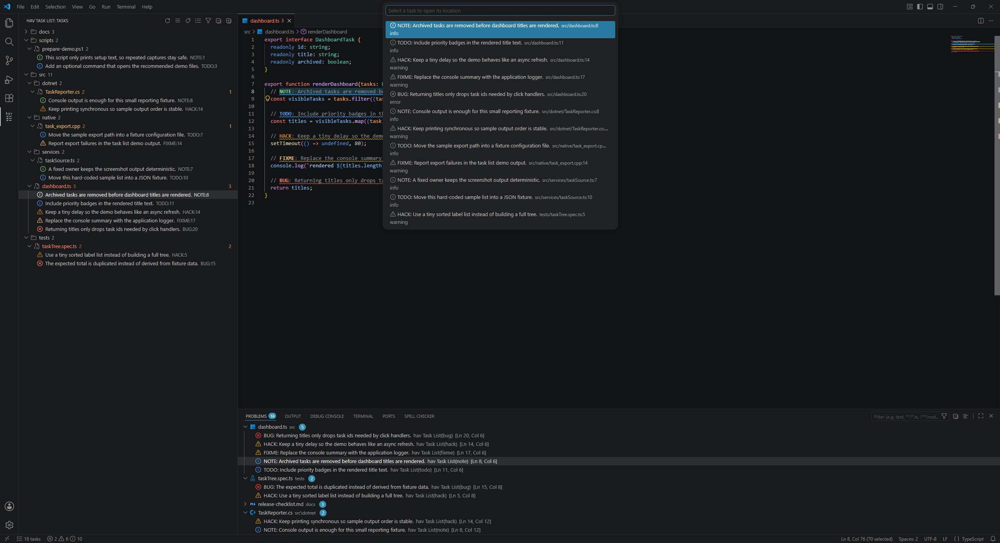
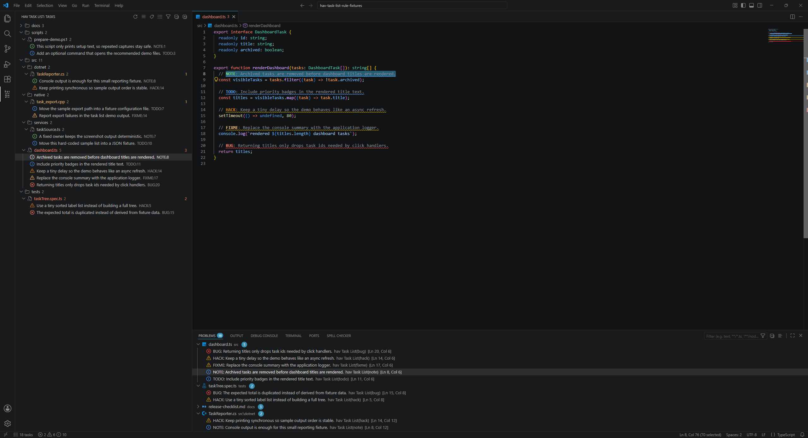

# hav Task List

**hav Task List** is a VS Code extension that scans workspace files for TODO-style task tags and shows them in a dedicated tree view.

Scan workspace files for task tags, view matches by folder, tag, or flat list, and jump straight to the source line.



## Table of Contents

- [Features](#features)
- [Screenshots](#screenshots)
- [Default Tags](#default-tags)
- [Commands](#commands)
- [VS Code Settings](#vs-code-settings)
- [Rule Format](#rule-format)
- [Build From Source](#build-from-source)
- [Contributing](#contributing)
- [License](#license)

## Features

- Scans workspace files for `TODO`, `FIXME`, `HACK`, `BUG`, `NOTE`, and custom regex tags
- Shows tasks in a dedicated **hav Task List** Activity Bar view
- Shows tasks by folder/file hierarchy, by tag, or as a flat list
- Filters the task tree without changing diagnostics or scan results
- Provides tree actions for refresh, grouping, filtering, expand, and collapse
- Opens tasks directly at the matching source range
- Shows optional diagnostics in the Problems view
- Highlights task tags in visible editors using rule colors
- Shows task counts in the Status Bar
- Automatically rescans when files or settings change
- Supports English and German UI strings

## Screenshots



_Task list workflow with tree, editor highlights, Problems entries, and Go to Task._



_Editor highlights with matching Problems entries._

## Default Tags

| Rule    | Severity | Color           | Purpose                      |
| ------- | -------- | --------------- | ---------------------------- |
| `todo`  | info     | `charts.blue`   | General follow-up work       |
| `fixme` | warning  | `charts.yellow` | Known code or content to fix |
| `hack`  | warning  | `charts.orange` | Temporary or suspicious code |
| `bug`   | error    | `charts.red`    | Known defect marker          |
| `note`  | info     | `charts.green`  | Useful implementation note   |

The default rules scan common code, config, script, and Markdown-like files. Their default file filter matches files ending in `.js`, `.jsx`, `.ts`, `.tsx`, `.vue`, `.svelte`, `.c`, `.cc`, `.cpp`, `.cxx`, `.h`, `.hpp`, `.hh`, `.hxx`, `.cs`, `.csx`, `.py`, `.rb`, `.php`, `.go`, `.rs`, `.java`, `.kt`, `.kts`, `.swift`, `.m`, `.mm`, `.scala`, `.sh`, `.bash`, `.zsh`, `.fish`, `.ps1`, `.psm1`, `.sql`, `.html`, `.css`, `.scss`, `.less`, `.md`, `.mdx`, `.json`, `.jsonc`, `.yaml`, `.yml`, `.toml`, `.ini`, `.cmake`, `.gradle`, or `.dockerfile`.

Default rules are meant for real task entries in code comments, scripts, and Markdown lists. Plain references to tag names are ignored.

Files larger than `havTaskList.maxFileSizeKb`, files containing null bytes, and common generated folders are skipped by default.

## Commands

- `hav Task List: Refresh Tasks`
- `hav Task List: Go to Task`
- `hav Task List: Group by File`
- `hav Task List: Group by Tag`
- `hav Task List: Show Flat View`
- `hav Task List: Filter Tree`
- `hav Task List: Clear Tree Filter`
- `hav Task List: Expand Tree`
- `hav Task List: Collapse Tree`

The Activity Bar view also includes compact title bar buttons for refresh, task navigation, grouping, filtering, expand, and collapse.

## VS Code Settings

```json
{
  "havTaskList.autoScan": true,
  "havTaskList.debounceMs": 250,
  "havTaskList.groupBy": "file",
  "havTaskList.maxFileSizeKb": 512,
  "havTaskList.showDiagnostics": true,
  "havTaskList.showEditorHighlights": true,
  "havTaskList.includeGlobs": ["**/*"],
  "havTaskList.excludeGlobs": [
    "**/.git/**",
    "**/.hg/**",
    "**/.svn/**",
    "**/node_modules/**",
    "**/bower_components/**",
    "**/dist/**",
    "**/out/**",
    "**/build/**",
    "**/coverage/**",
    "**/.next/**",
    "**/.nuxt/**",
    "**/.turbo/**"
  ],
  "havTaskList.rules": [
    {
      "id": "todo",
      "label": "TODO",
      "pattern": "(?:^|\\s)(?://|#|<!--|/\\*|\\*|--|;|-)\\s*\\bTODO\\b(?::\\s*|\\s+)(.*)",
      "severity": "info",
      "color": "charts.blue",
      "filePattern": "\\.(ts|tsx|js|jsx|md)$"
    }
  ]
}
```

## Rule Format

```ts
interface havTaskListRule {
  id: string;
  label?: string;
  pattern: string;
  severity: "off" | "info" | "warning" | "error";
  color?: string;
  filePattern?: string;
}
```

`havTaskList.groupBy` supports `file`, `tag`, and `flat`.

`pattern` and `filePattern` are JavaScript regular expressions matched case-insensitively. `filePattern` is tested against the workspace-relative file path. The first capture group in `pattern` is used as the task text when present. `severity: "off"` disables a rule. `color` is a VS Code theme color ID used for tree icons and editor tag highlights, such as `charts.blue`, `charts.orange`, or `charts.red`.

## Build From Source

```bash
git clone https://github.com/Havoc7891/hav-task-list.git
cd hav-task-list

npm install
npm run compile
npm run package
```

**NOTE:** The VSIX package is written to the repository root.

## Contributing

Thank you for your interest! Suggestions for features and bug reports are always welcome via issues.

To maintain a consistent design and quality for this extension, changes are implemented by the maintainer rather than via direct pull requests.

## License

This extension is licensed under the [MIT License](LICENSE).
